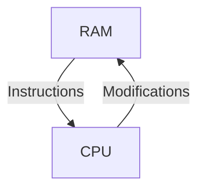
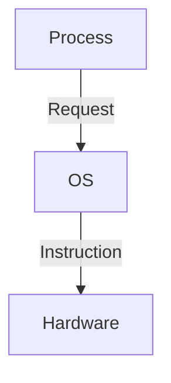

# Intoduction
What is an Operating System?
- a piece of software that manages resources (CPU time, memory, I/O, security)
- abstracts details

## Von Neumann Architecture
- AKA "stored program" concept
- assuming the machine uses VNA in this course
- single memory (RAM)
- vs. Harvard (1 memory for instructions, 1 for data)

Basic architecture:
1. Fetch instructions from RAM
2. Instructions can modify other RAM locations
   - Can contain data and/or code
   - Self-modifying code is possible but typically slow

## Abstraction
Each process has an illusion of
- exclusive CPU time
- huge amounts of RAM
- exclusive access to I/O
- transparent security

We have to worry about sharing the resources
- exclusive access = *virtualization*

## Security
- OS is most trusted piece of software
- each process "asks permission" from OS to do certain tasks
- OS monitors the health of the system

## Virtualization
Example of memory virtualization: 3 programs
- partitioning
  - protection problems (modifying other processes' memory)
  - relocation problem (problems built for one partition may not work when loaded into a different one)
- process lives in address space
  - enumeration of all possible elements
