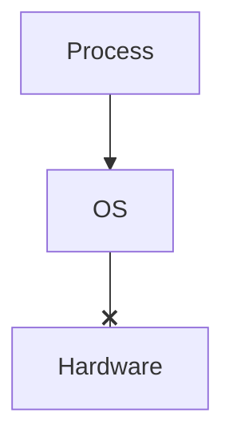
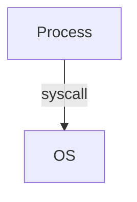

# Memory
Memory lives in an address *space* (the enumeration of all values of a thing)
- address size: 32 bits (64 bits as well)
- for each address, there is one byte (byte addressable)
  - can load exactly one byte, not less
  - there are 4 GB of memory for each process
- enumerating every byte (from the program perspective) is exclusive to that program
## OS has the Power
- OS can deny requests

- OS can not be bypassed
## How do apps interface with OS?
*SYSCALLS*

- input, output, play sounds, get random number, etc
## Example
User program
```C
HANDLE h = get_resource();
if(!h) {
    // can not use resource
}
```
OS
```C
HANDLE get_resource() {
    if(/* caller has permission */) {
        return get_resource_handle();
    }
    return NULL;
}
```
if OS is just software itself, why can't users just use the same source code
- instruction set has (at least) 2 subsets
  - Protected/user mode (every instruction we wrote [AND, SHIFT])
  - Privileged/kernel mode (core of OS)
    - May access hardware, move data, etc
    - Guarded by a bit in a register (which can only be changed by privileged mode instructions)
    - raises *exception* if privileged instructions are attempted by user mode processes and sends signal (SIGIL) to process